# Web Interface

AutoNetwork provides a comprehensive web interface for WiFi configuration and device management. The web server intelligently adapts its behavior based on WiFi connection status, providing a seamless user experience.

## Overview

The web interface is built using `ESPAsyncWebServer` and serves pages from embedded HTML stored in the library. All web pages share a consistent design with CSS variables for easy theming.

### Key Features

- **Automatic AP Mode Redirection**: When not connected to WiFi, root path (`/`) redirects to AutoNetwork configuration portal
- **Configuration Portal**: Full-featured WiFi setup with network scanning and credential management
- **System Statistics**: Real-time WiFi and hardware information
- **OTA Updates**: Over-the-air firmware update capability
- **Saved Credentials**: Manage multiple WiFi network credentials
- **Custom Integration**: Easy integration with your application's web pages

## Web Server Endpoints

### `/` (Root Path)

The main entry point adapts based on WiFi status and content configuration:

- **AP Mode** (not connected): Redirects to `/_an` (AutoNetwork portal)
- **Connected with content**: Serves configured root content (file, callback, or direct HTML)
- **Connected without content**: Displays error page with guidance

**Configuration:**

AutoNetwork manages the root handler automatically. Configure content using `setRootContent()`:

```cpp
// Option 1: Serve from LittleFS file
portal.setRootContent("/index.html");

// Option 2: Dynamic content via callback
portal.setRootContent([]() {
    return "<html><body>Current time: " + String(millis()) + "</body></html>";
});

// Option 3: Direct HTML string
portal.setRootContent(R"rawliteral(
<!DOCTYPE html>
<html><body><h1>My App</h1><p>{{AUTONETWORK_MENU}}</p></body></html>
)rawliteral");
```

**Behavior:**

- Root handler automatically registered during `autoConnect()`
- In AP mode: Always redirects to `/_an` regardless of content
- In STA mode: Serves configured content or error page if empty/missing
- Placeholder `{{AUTONETWORK_MENU}}` replaced with AutoNetwork menu link
- Triggers `onWebpageAccessed()` callback on first access

**Error Handling:**

If root content is empty or missing, AutoNetwork serves an error page (HTTP 500) with:
- Warning icon and clear error message
- Link to AutoNetwork menu (`/_an`)
- Developer guidance referencing `setRootContent()`
- Serial log warnings with details

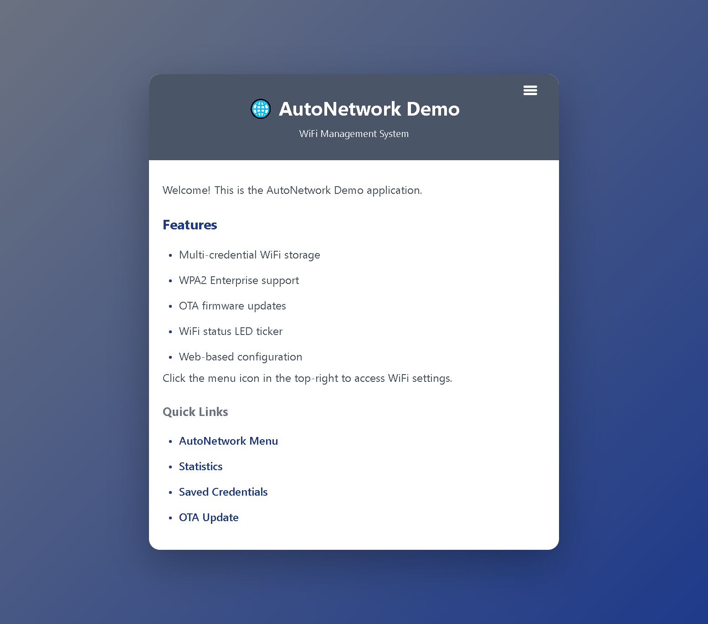

### `/_an` (AutoNetwork Main Menu)

The main menu provides navigation to all configuration and management pages.

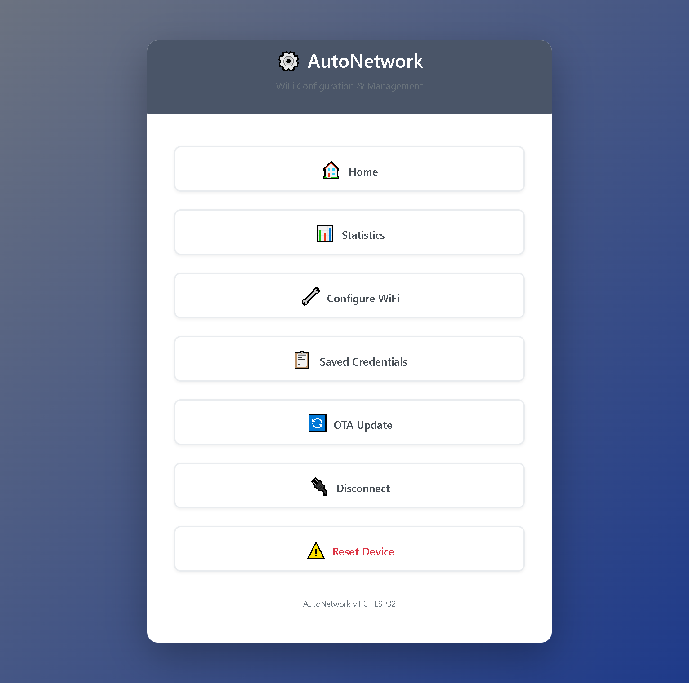

**Features:**
- Configure WiFi connection
- View system statistics
- Manage saved credentials
- OTA firmware updates
- Disconnect from WiFi
- Reset device

### `/_an/config` (WiFi Configuration)

Scan for available networks and configure new WiFi connections.

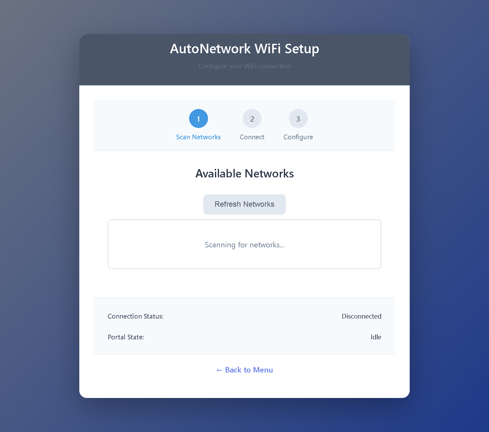

**Related Endpoints:**
- `/_an/scan` (GET): Scans for available WiFi networks
- `/_an/connect` (POST): Submits WiFi credentials to connect
- `/_an/status` (GET): Provides real-time connection status updates

**Features:**
- Network scanning with RSSI signal strength
- WPA2 Personal and Enterprise support
- Connection status monitoring
- Automatic credential saving (configurable)

### `/_an/open` (Saved Credentials)

View and manage previously saved WiFi credentials.

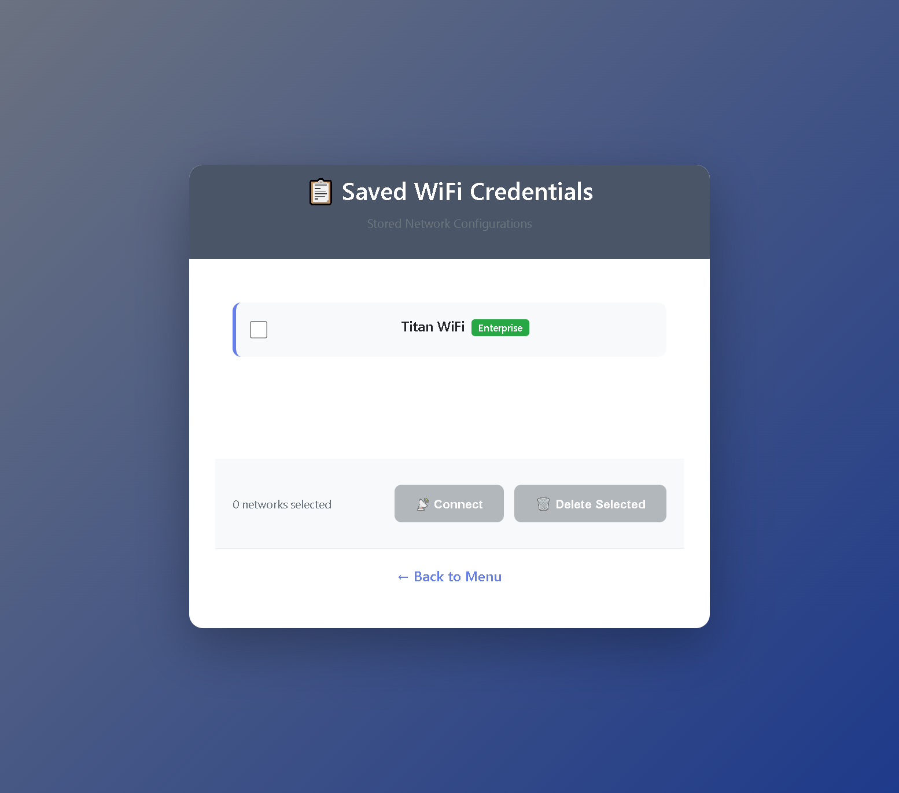

**Related Endpoints:**
- `/_an/connect_saved` (POST): Connect to a saved network
- `/_an/delete_creds` (POST): Delete selected credentials

**Features:**
- List all saved networks
- Quick connect to saved networks
- Bulk delete credentials
- SSID and connection count display

### `/_an/stats` (System Statistics)

Displays comprehensive WiFi and hardware information.

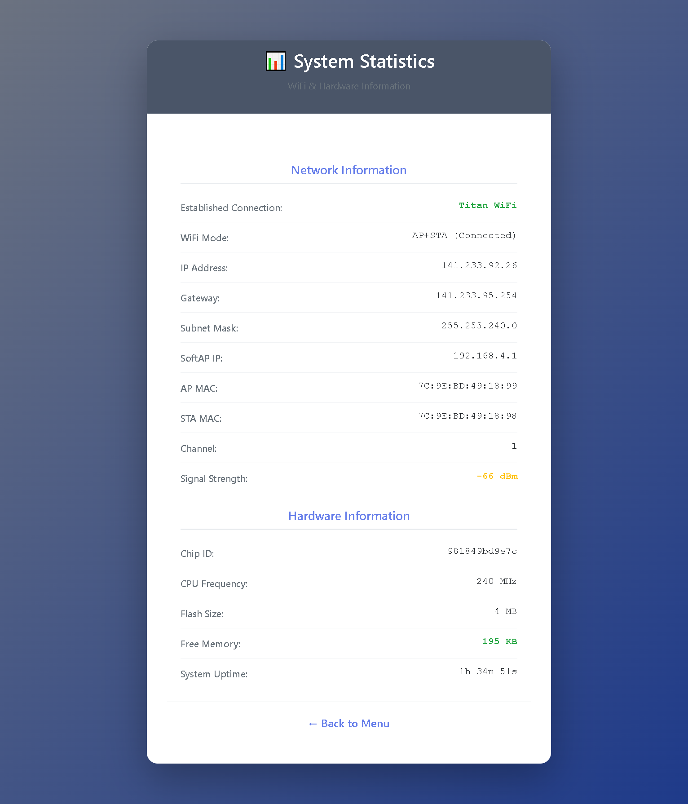

**Information Provided:**
- WiFi connection status (SSID, IP, MAC, RSSI)
- ESP32 chip info (model, cores, flash size)
- Memory usage (heap, flash)
- Network configuration (gateway, subnet, DNS)
- Uptime and connection statistics

### `/_an/ota` (OTA Updates)

Over-the-air firmware update interface.

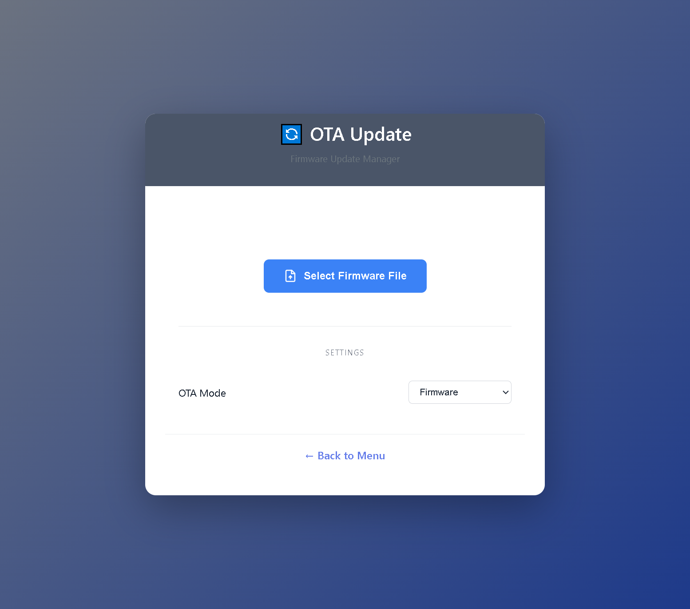

**Uploading Firmware:**

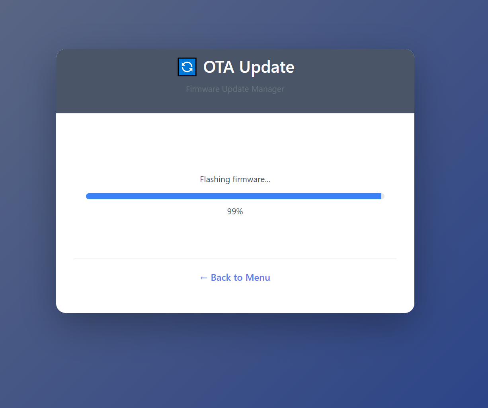

**Upload Error:**

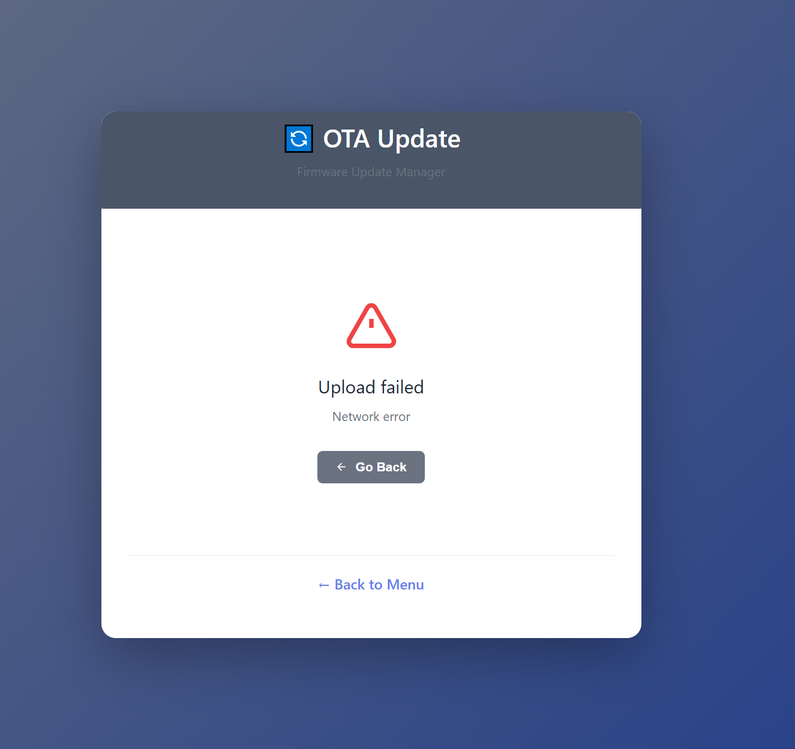

**Upload Success:**

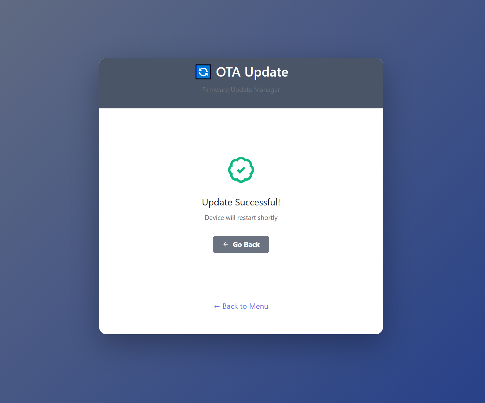

**Related Endpoints:**
- `/ota/start` (GET): Initiates OTA update process
- `/ota/upload` (POST): Handles firmware file upload
- `/ota/status` (GET): Polls for real-time progress
- `/ota/reboot` (POST): Triggers device restart after successful upload

**Features:**
- Firmware file upload with progress bar
- Real-time upload status via polling
- Two-request pattern for clean restart handling
- 3-second success display before reboot trigger
- Separate upload and reboot requests (AutoConnect-inspired)
- Error handling and reporting

### `/_an/disc` (Disconnect WiFi)

Disconnect from the current WiFi network and return to AP mode.

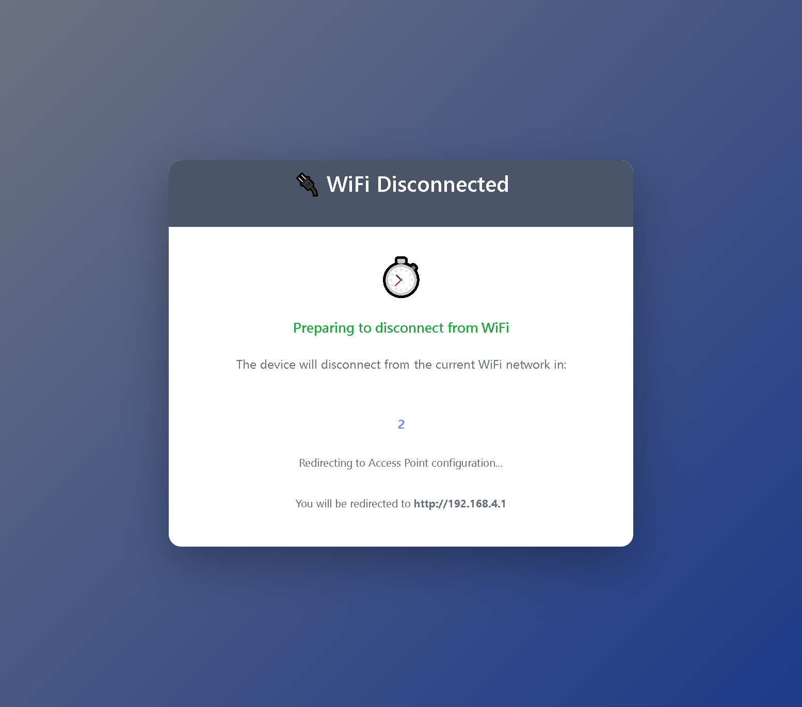

**Behavior:**
- Disconnects from current network
- Enables AP mode
- Redirects to configuration portal
- Preserves saved credentials

### `/_an/reset` (Reset Device)

Trigger a software reset of the ESP32.

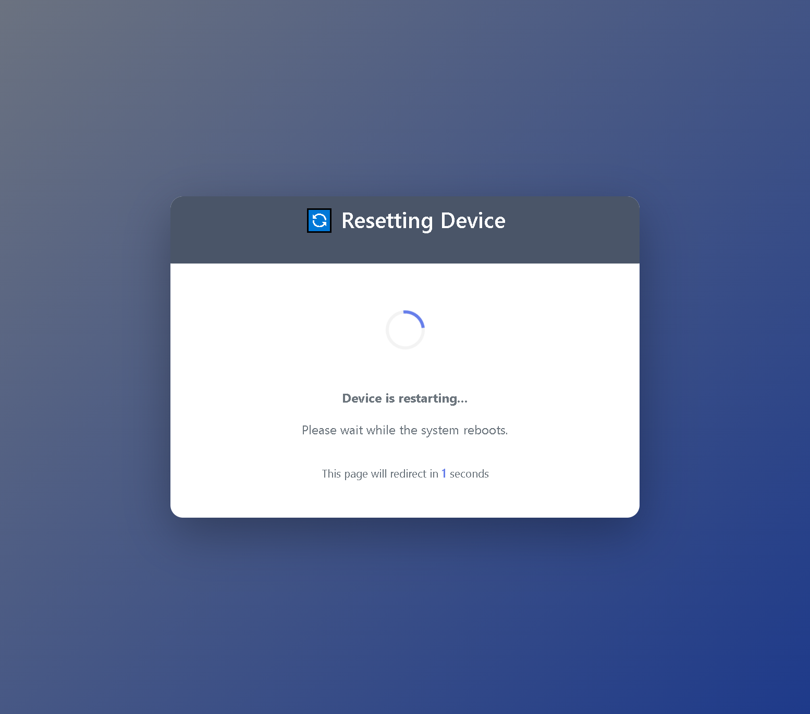

**Behavior:**
- Initiates ESP32 software reset
- Reloads with saved configuration
- Redirects to main menu after reboot

### Error Page (Root Content Missing)

Displayed when root content is empty, missing, or fails to load.

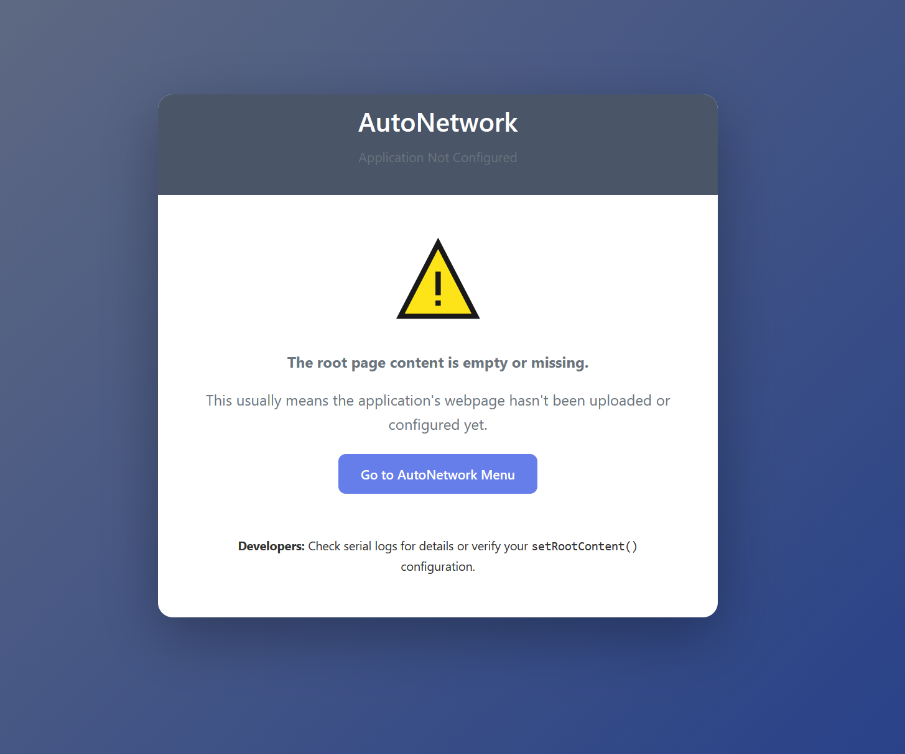

**File:** `lib/AutoNetwork/src/webpage_error.h`

**When Shown:**
- Root content file not found in LittleFS
- Root content file is empty or whitespace-only
- Root content callback returns empty string
- No root content configured via `setRootContent()`

**Features:**
- HTTP 500 status code
- Warning icon (⚠️) for visual indication
- Clear error message explaining the issue
- Direct link to AutoNetwork menu (`/_an`)
- Developer guidance referencing `setRootContent()`
- Serial log warnings with detailed diagnostics

**Purpose:**
Prevents blank/white pages when content is missing, provides user-friendly error messaging, and guides developers to configure root content correctly.

## Integration with Your Application

### Configuring Root Content

AutoNetwork manages the root (`/`) handler automatically. Configure content before or after calling `autoConnect()`:

```cpp
void setup() {
    Serial.begin(115200);

    // Configure root content (choose one method)
    portal.setRootContent("/index.html");  // From LittleFS file
    // OR
    portal.setRootContent([]() { return "<html>...</html>"; });  // Dynamic callback
    // OR
    portal.setRootContent(R"rawliteral(<html>...</html>)rawliteral");  // Direct HTML

    portal.autoConnect();  // Root handler registered automatically
}
```

**Important:** Do NOT manually register `portal.on("/", ...)` - AutoNetwork handles this internally.

### Adding Custom Pages

Register custom page handlers **before** calling `autoConnect()`:

```cpp
portal.on("/custom", HTTP_GET, [](AsyncWebServerRequest *request) {
    String html = "<html><body><h1>Custom Page</h1>";
    html += "<p>{{AUTONETWORK_MENU}}</p>";  // Add menu placeholder
    html += "</body></html>";

    html.replace("{{AUTONETWORK_MENU}}", AUTONETWORK_LINK());  // Replace with link
    request->send(200, "text/html", html);
});

portal.autoConnect();  // Start AutoNetwork after registering custom routes
```

## Best Practices

1. **Use setRootContent()**: Configure root content via `setRootContent()` instead of manually registering `portal.on("/")`

2. **Register custom routes before autoConnect()**: Ensure your custom page handlers are registered before calling `autoConnect()`

3. **Use AUTONETWORK_LINK()**: Always provide a link back to AutoNetwork configuration from your pages via `{{AUTONETWORK_MENU}}` placeholder


## Troubleshooting

### Error page displays instead of root content

**Symptoms:** Warning icon (⚠️), "Application Not Configured" error page

**Causes & Solutions:**
- **File not found**: Verify `/index.html` exists in `data/` directory before uploadfs
- **Empty file**: Check file has content, not just whitespace
- **Callback returns empty**: Verify callback function returns non-empty HTML string
- **Not configured**: Add `portal.setRootContent()` call before or after `autoConnect()`
- **LittleFS not uploaded**: Run `platformio run --target uploadfs` to upload files

**Check serial logs** for detailed error messages indicating exact cause.

### Pages not loading

- Verify `AutoNetwork` initialized before accessing pages
- Check serial output for server initialization messages
- Ensure no conflicting route registrations
- **Don't manually register `/` route** - use `setRootContent()` instead

### Images/CSS not loading

- Verify files uploaded to LittleFS (`uploadfs` target)
- Check file paths (case-sensitive!)
- Monitor heap usage (large files may cause memory issues)
- Ensure CSS file exists at `/global.css` if referenced

### Can't access portal in AP mode

- Verify AP SSID and password
- Check device is in AP mode (`WiFi.status() != WL_CONNECTED`)
- Try accessing via IP: `192.168.4.1`
- Ensure no firewall blocking on client device

### onWebpageAccessed() callback not firing

- Verify callback registered **before** `autoConnect()`
- Check that pages are actually being accessed (serial logs)
- Ensure web server is running (no crashes during initialization)
